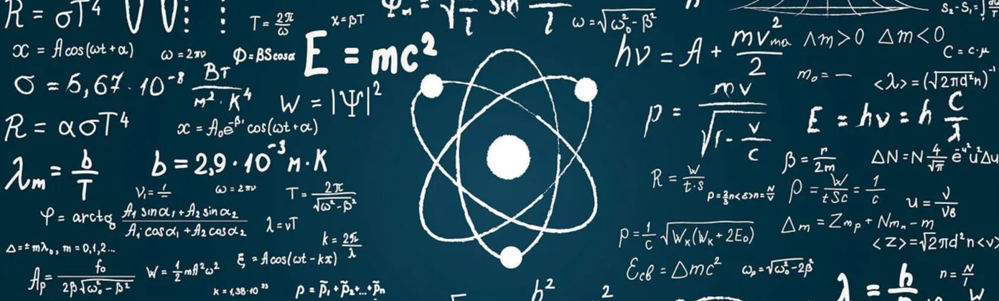

<!-- GitHub Profile: Zeeshan Ajmal -->

<h1 align="left">Zeeshan Ajmal</h1>

  Doctoral Researcher · Cyber Exposure & Vulnerability Lead · Quantum Cybersecurity & AI

  <a href="https://www.linkedin.com/in/xeeshanajmal">LinkedIn</a> ·
  <a href="https://github.com/xeeshanajmal">GitHub</a> ·
  <a href="https://medium.com/@xeeshanajmal">Medium</a> ·
  <a href="mailto:zeeshan.ajmal@oulu.fi">Email</a>

---

## About

I am a doctoral researcher in Computer Science at the **University of Oulu**, focusing on **quantum cybersecurity** and the use of **AI/ML and agentic AI** to detect and mitigate security threats.

Alongside my research, I work as a **Cyber Exposure and Vulnerability Lead** in Oulu, where I help improve visibility into internet-facing assets, identify critical exposures, and work with engineering teams to reduce risk in production environments.

My background combines:
- Security engineering and penetration testing  
- Quantum computing and secure AI systems  
- Cloud security across AWS, Azure, and GCP  
- Threat intelligence, vulnerability management, and compliance

---

## Current Roles

### Doctoral Researcher – Quantum Cybersecurity  
**University of Oulu**

- PhD research on **quantum cybersecurity using AI/ML and agentic AI**  
- Completed master’s thesis:  
  _“Using artificial intelligence and machine learning to detect malicious quantum circuits”_  
- Focus areas: malicious quantum circuit detection, secure quantum software development, and LLM-based reasoning for secure quantum workflows

### Cyber Exposure & Vulnerability Lead – Oulu

- Improve the **NCSC Feed** and exposure monitoring for internet-facing assets  
- Map, track, and document vulnerabilities across products and services  
- Use tools such as **Nmap, Masscan, ProjectDiscovery, Shodan, Wireshark, Metasploit**, and CVE/CWE analysis  
- Work closely with product and engineering teams to prioritize remediation and improve secure-by-design practices  
- Align work with security frameworks such as **MITRE ATT&CK** and common regulatory / compliance needs

---

## Research & Professional Interests

- Quantum cybersecurity and secure quantum software  
- AI-powered threat detection and security automation  
- LLM and agentic AI security (prompt injection, data exfiltration, jailbreaks)  
- Secure AI systems (adversarial ML, privacy-aware ML)  
- Internet-wide exposure mapping and attack surface management  
- Cloud security (Azure, AWS, GCP) and DevSecOps

---

## Skills & Tools

**Programming & Data**

- Python, Bash, SQL  
- Data analysis and visualization

**AI, ML & LLMs**

- Classical ML for security analytics  
- LLM-based applications and agentic workflows  
- Applied use of frameworks such as LangChain / similar LLM stacks

**Quantum Computing**

- Qiskit and quantum circuit experimentation  
- Research on malicious quantum circuits and secure quantum protocols

**Security Engineering & Offensive Security**

- Network and web application penetration testing  
- Threat modeling, risk analysis, and secure architecture review  
- Tools: Nmap, Masscan, Shodan, Burp Suite, Metasploit, Nessus, Wireshark, ProjectDiscovery stack, OpenVAS, SIEM platforms

**Cloud & DevSecOps**

- AWS, Azure, GCP  
- Docker, container security, CI/CD integration (e.g., GitHub Actions)  

---

## Publications & Thesis

- **Master’s Thesis (University of Oulu)**  
  _Using artificial intelligence and machine learning to detect malicious quantum circuits_  
  Focus on combining quantum computing with ML-based detection of malicious behavior in quantum circuits.

- **Ongoing PhD Research**  
  Quantum cybersecurity with AI/ML and agentic AI, including secure development practices and automated detection of misuse in quantum and AI systems.

---

## Collaboration

I am open to:

- Research collaboration in **quantum cybersecurity**, **secure AI**, and **threat detection**  
- Joint security projects and tooling (exposure management, LLM security, quantum-safe designs)  
- Guest talks, seminars, and workshops on cybersecurity, AI, and quantum topics

You can reach me via **[email](mailto:zeeshan.ajmal@oulu.fi)** or **[LinkedIn](https://www.linkedin.com/in/xeeshanajmal)**.

---
